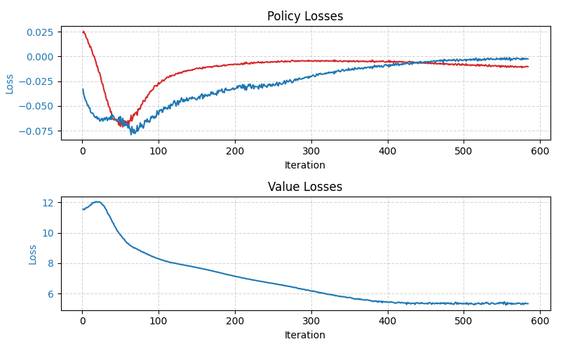
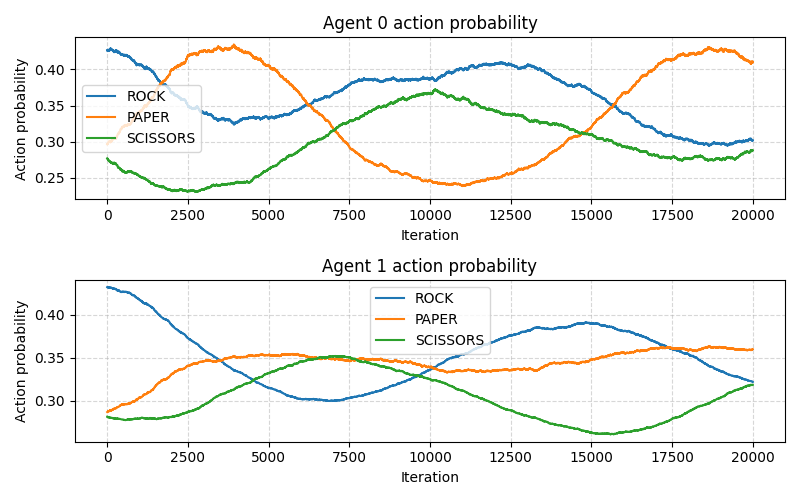
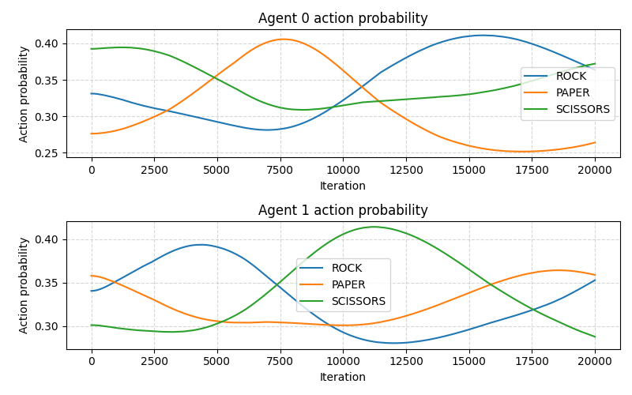
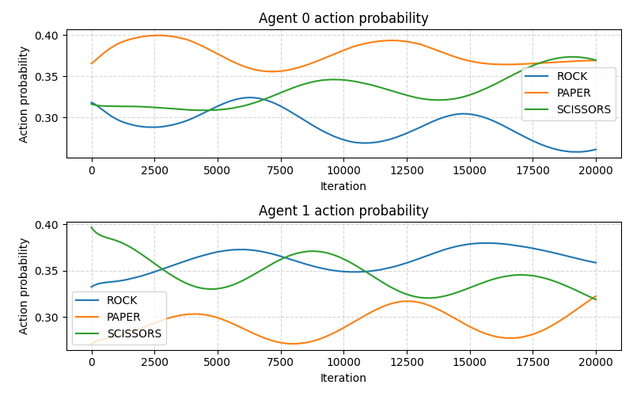

<h1>Policy gradient algorithms</h1>

This repository contains three policy gradient RL algorithms applied to three games - rock paper scissors, 
<a href="https://github.com/rmurphy120/FictitiousPlay" target="_blank">the car game, and the soccer game</a>. These are
a class of algorithms which tries to find the optimal policy through machine learning. The general framework is that the
state is fed into a network which outputs a policy directly. Using the policy gradient theorem, you can learn an optimal
policy. <a href="https://lilianweng.github.io/posts/2018-04-08-policy-gradient/" target="_blank">This blog</a> is a 
great survey of policy gradient algorithms. It includes a lot of the theory behind these algorithms. Usually these algorithms
are framed within single agents problems, but this project was interested in the multi-agent formulation of these 
algorithms. 

<h3>REINFORCE</h3>

This is the original policy gradient algorithm. It samples a sequence of states on-policy (Called a trajectory)
which is uses to estimate Q.

<h3>A2C</h3>

This is a foundational policy gradient algorithm that falls under the actor-critic paradigm which is featured in 
many policy gradient algorithms. In addition to networks being used to model the policy of the agents (Actors), 
additional critic networks are used to estimate the value function of each player (One critic network can be used for 
both agents if the game is zero-sum or common‑payoff). Traditional A2C uses trajectories to estimate V to learn the 
actor and critic networks, but we altered it to take the expectation over all actions pairs to calculate V directly, 
thus better learning the critic network and reducing variance. One advantage of A2C is we can use the value network
to determine convergence of the system, where REINFORCE has an arbitrary cutoff.

Below is a graph of the policy losses and the value loss throughout training on the car game.

<h3>SAC</h3>

This is a recent algorithm that aims to add entropy to the loss function. This does two things: encourages 
early exploration and helps to find mixed strategies. Though on the latter, the algorithm tries to learn a uniform 
entropy across states, so it really isn't ideal to find mixed strategies. I've implemented this algorithm on a discrete 
action space (The original was formulated for a continuous action space) with automatically adjusted temperature 
(An otherwise sensitive hyperparameter). I also use a target value network and double Q-learning (Which are commonly 
used tricks to improve performance).

<h3>Performance on Rock Paper Scissors</h3>
<h4>REINFORCE</h4>

<h4>A2C</h4>

<h4>SAC</h4>

The above graphs plot the policy of each agent across training. The policies REINFORCE and A2C produce have similar 
bounds, and in general they exhibit the same behavior, but A2C is noticeably smoother. The graphs give a good intuition 
how these algorithms are driven by best response dynamics - an agent that plays paper a lot causes the other agent to 
play scissors a lot and so on. It also illustrates the difficulty these algorithms have with modeling mixed nash 
equilibrium. SAC doesn't converge, and it's behavior is a little more complicated because it takes into account entropy.

<h3>Performance on the Car and Soccer Games</h3>

All three algorithms give subpar performance on these games. The issue is that these algorithms converge to 
deterministic policies much easier than mixed policies. These two games, however, have
many states where there is no deterministic Nash equilibrium, only mixed. So these policies will fail at these states, 
which have repercussive effects to other states that do have deterministic Nash equilibrium (Because every state affects 
neighboring states). The reason this doesn't happen in rock paper scissors is there isn't enough complexity to 
destabilize it.
