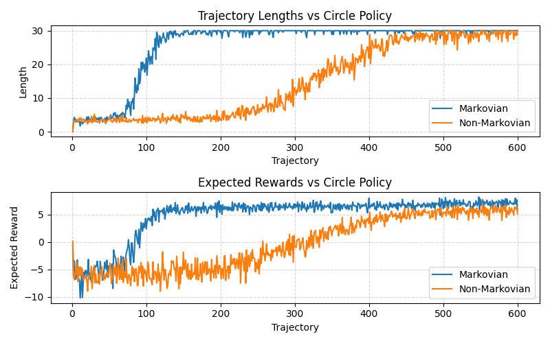
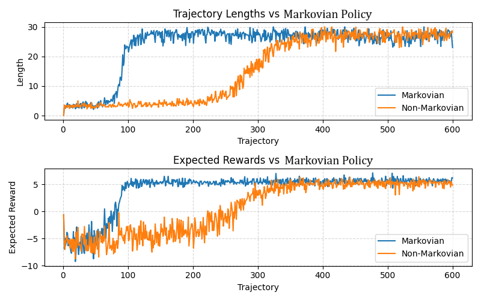
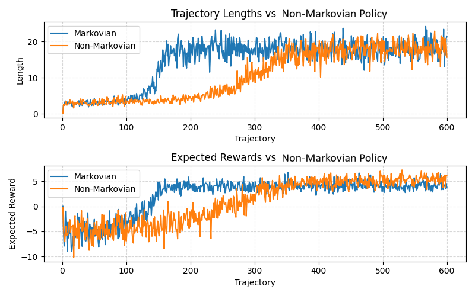

<h1>Policy gradient algorithms</h1>

This repository contains three policy gradient RL algorithms applied to three games - rock paper scissors, 
<a href="https://github.com/rmurphy120/FictitiousPlay" target="_blank">the car game, and the soccer game</a>. These are
a class of algorithms which tries to find the optimal policy of a game through machine learning. The general framework is that the
state is fed into a network which outputs a policy directly. Using the policy gradient theorem, you can learn an optimal
policy. <a href="https://lilianweng.github.io/posts/2018-04-08-policy-gradient/" target="_blank">This blog</a> is a 
great survey of policy gradient algorithms. It includes a lot of the theories behind these algorithms. As a note, 
usually these algorithms are framed within single agents problems, but this project was interested in the multi-agent 
formulation of these algorithms.

<h3>REINFORCE</h3>

This is the original policy gradient algorithm. It samples a sequence of states on-policy (called a trajectory)
which is uses to estimate Q.

<h3>A2C</h3>

This is a foundational policy gradient algorithm that falls under the actor-critic paradigm which is featured in 
many policy gradient algorithms. In addition to networks being used to model the policy of the agents (actors), 
additional critic networks are used to estimate the value function of each player. Traditional A2C uses trajectories to 
estimate V to learn the actor and critic networks, but we altered it to take the expectation over all actions pairs to 
calculate V directly, thus reducing variance.

Below is a graph of the policy losses and the value loss throughout training on the car game.

<h3>SAC</h3>

This is a more recent algorithm that aims to add entropy to the loss function. This does two things: encourages 
early exploration and helps to find mixed strategies. Though on the latter, the algorithm tries to learn a uniform 
entropy across states, so it really isn't ideal to find mixed strategies. I've implemented this algorithm on a discrete 
action space (the original was formulated for a continuous action space) with automatically adjusted temperature 
(an otherwise sensitive hyperparameter). I also use a target value network and double Q-learning (which are commonly 
used tricks to improve performance).

<h3>Performance on Rock Paper Scissors</h3>
<h4>REINFORCE</h4>

<h4>A2C</h4>

<h4>SAC</h4>

The above graphs plot the policy of each agent across training. The policies REINFORCE and A2C produce have similar 
bounds, and in general they exhibit the same behavior, but A2C is noticeably smoother. The graphs give a good intuition 
how these algorithms are driven by best response dynamics - an agent that plays paper a lot causes the other agent to 
play scissors a lot and so on. It also illustrates the difficulty these algorithms have with modeling mixed nash 
equilibrium. SAC doesn't converge, and it's behavior is a little more complicated because it takes into account entropy.

<h3>Performance on the Car and Soccer Games</h3>

All three algorithms give subpar performance on these games. The issue is that these algorithms converge to 
deterministic policies much easier than mixed policies. These two games, however, have
many states where there is no deterministic Nash equilibrium, only mixed. So these policies will fail at these states, 
which have repercussive effects to other states that do have deterministic Nash equilibrium (because every state affects 
neighboring states in training). The reason this doesn't happen in rock paper scissors is there isn't enough complexity to 
destabilize it.

<h1>Partial Observability</h1>

I've talked a lot about the shortcomings of these algorithms, but there are reasons one might use these. Firstly, is 
that they scale well with game size and support continuous states and action spaces. Secondly, the reason which prompted 
this research, is that they adapt easily to partially observable environments. Partial observability means that the agent 
has incomplete or unreliable information on the state. You can image a robot waiter trying to navigate a busy restaurant. 
It cannot see the entire restaurant, and it can no longer see that person that just went behind a corner. It might 
benefit the robot to remember there's a person just out of sight to avoid running into them. This exemplifies how 
these environments are non-markovian - the robot's guess of the true state should rely on prior states. It is easy to adapt 
these algorithms to this task - just swap the neural network for an RNN (in this case, an LSTM).

<h3>Performance Comparison on the Car Game</h3>
<h4>Fixed Circle Policy</h4>

<h4>Fixed Markovian Policy (Standard REINFORCE)</h4>

<h4>Fixed Non-Markovian Policy (REINFORCE with LSTM)</h4>

Above are three plots comparing the performance of the Markovian and non-Markovian policies on the car game. While 
this is a Markovian environment, we wanted to compare the performance of the two policies. We did this by fixing three 
different policies as the evaders - the circle policy (deterministic policy where the car goes in circles around the 
board), a pretrained Markovian policy, and a pretrained non-Markovian policy - and training these
policies as pursuers. The expected returns and lengths of the 
trajectories are plotted above (a trajectory ends when an agent goes off the board, so when the trajectories are longer, 
that implies the agent learns to not go off the board). An expected result is that the non-Markovian policy converges 
slower (because an LSTM is less "direct" than a neural network). The more interesting result is that both perform 
identically well. This supports the argument for using these algorithms in partially observable environments.

<h1>Next Steps</h1>

With Markov games, we have effective ways to find exact Nash equilibrium. The same is not true for partially 
observable games. Therefore, we cannot really make "baselines" to which we can compare these DRL algorithms. So it's 
hard to be able to study the performance of these algorithms in these contexts. Next steps would be to develop and 
optimize these exact solvers to solve non-trivial partially observable games, but how this is done is not clear.
